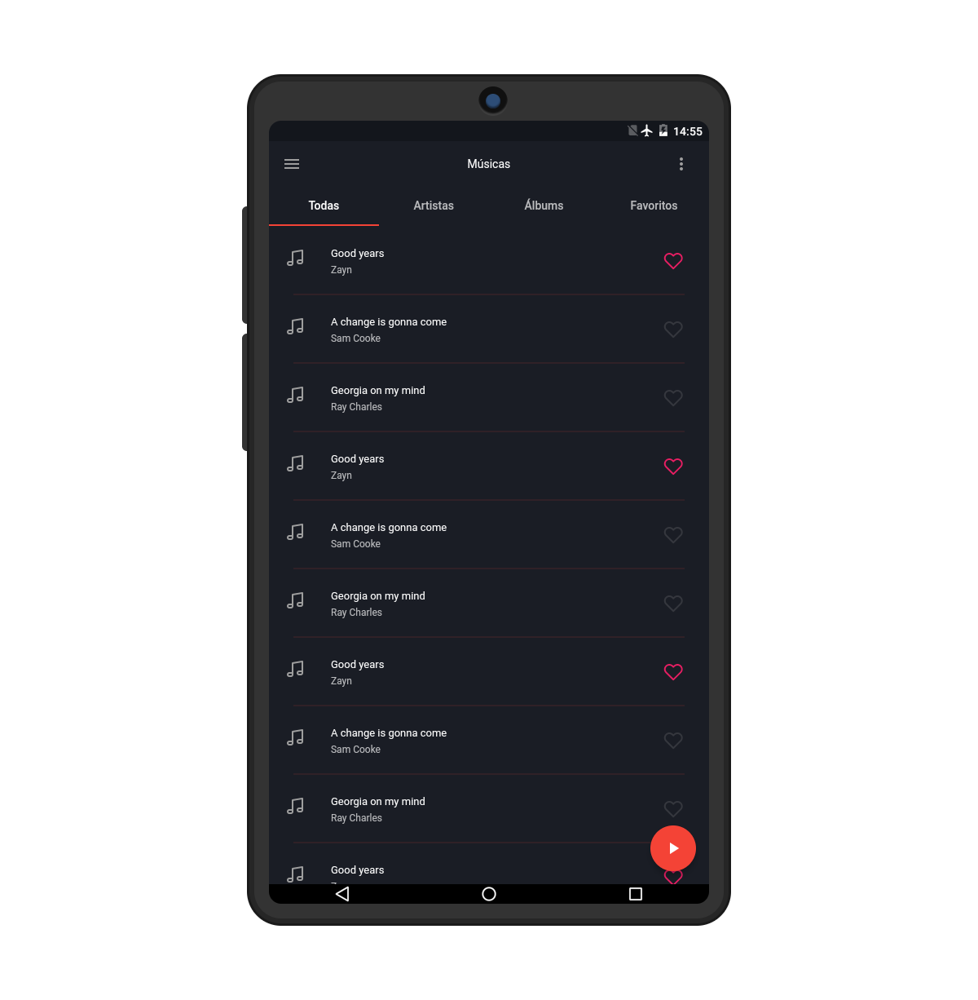
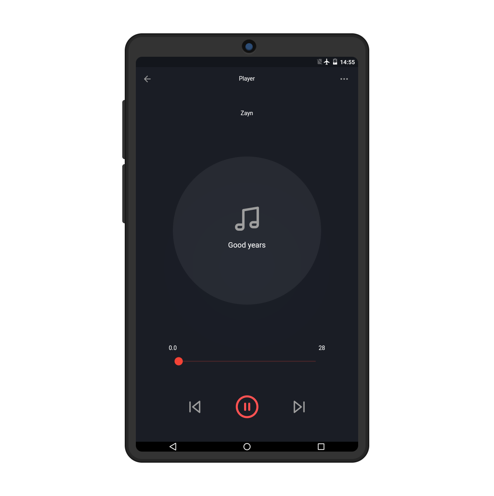
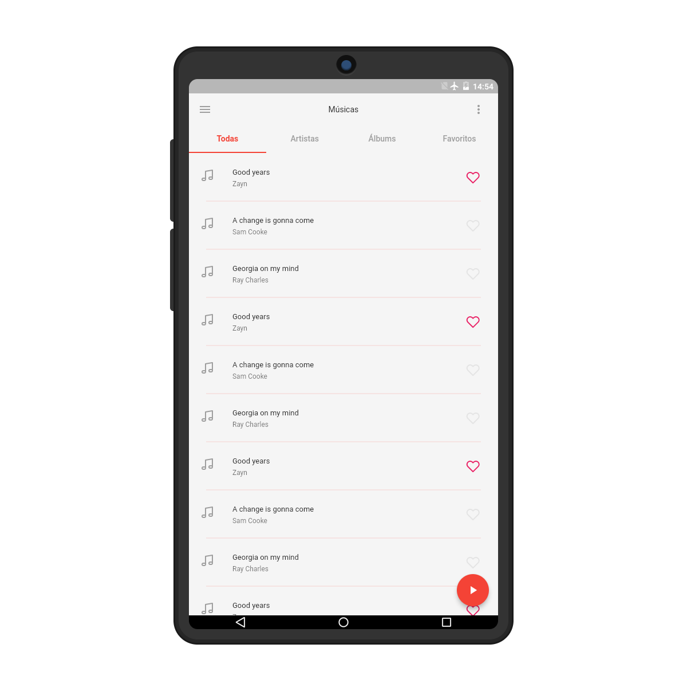

<h1 align="center">inSound</h1>

<h3 align="center" id="about"> A beautiful music player built with flutter</h3>

<h4 align="center"> 
	(still developing...  🚧)
</h4>

<h1 align="center">
  
  
  
</h1>

### Table of content

<!--ts-->

- [About](#about)
- [Features](#features)
- [Requirements](#requirements)
- [How to run](#running)
- [Technologies](#technologies)
<!--te-->

<br>

### Features

- [x] Light/Dark theme
- [ ] store theme preference
- [ ] play music
- [ ] Status bar controlls
- [ ] Custom Widgets

### Requirements

Before you start, you need to install the following tools:
[Flutter SDK](https://github.com/flutter/flutter), [Android Studio](https://developer.android.com/studio/index.html#downloads). You might wanna have a good text editor like [VSCode](https://code.visualstudio.com/)

### Running

```bash
 # Clone this repo
$ git clone <https://github.com/augusto-carlos/insound>

# Change directory to the repository folder using terminal/cmd
$ cd insound

# Run the app with flutter
$ flutter run
```

### Technologies

The following tools was used to build this project:

- [Flutter](https://flutter.dev/)
- [Father Icons for flutter](https://pub.dev/packages?q=father_icon)
